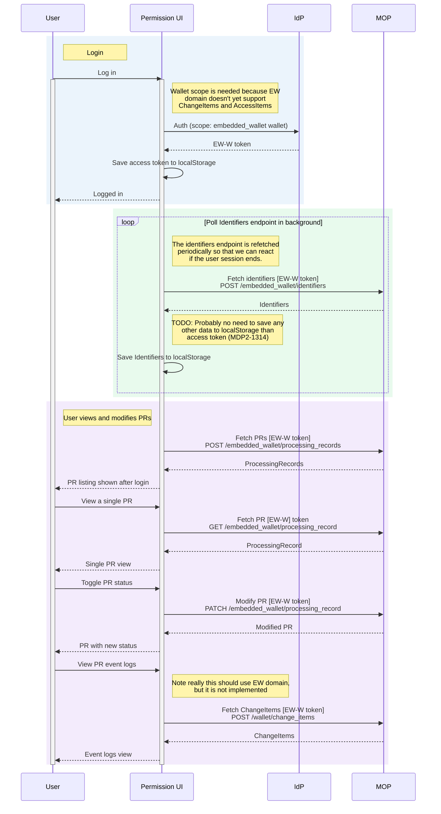

# MyDataShare Permission UI

## Overview

Permission UI is the reference implementation of a MyDataShare customer's service that they provide to their end users. 

Permission UI provides the following features: 

- Authentication of an end user 
- Listing the processing records that target the end user
- Displaying the details of a processing record, and allowing the end user to interact with them. 

### Interaction modes

Permission UI can be utilized in two modes. 

In pre-seeded mode the customer targets the end users directly, each processing record is explicitly created - either using the MyDataShare API or `Dashboard` administration tool. Pre-seeded mode is usable without any extra configuration actions. 

In enrollment mode Permission UI targets the end users after they have authenticated themselves. Enrollment requires the use of `enroller` tool, whose use is covered below and in enroller's documentation. 

### Notes

Permission UI utilizes Pro icons from [Font Awesome](https://fontawesome.com/), and a commercial license is required to utilize them. 

## Architecture



## Deployment configuration

Permission UI configuration settings are controlled using environment variables.

Here you can find information about all available settings **for deployments**.

### `REACT_APP_AUTH_ITEM_NAMES` (required)

**Example: `Log in with a randomly generated user;Log in with a test user`**

A semicolon separated list of MDS API AuthItems to display as login methods specified by their `name` field.

### `REACT_APP_ENROLL_NAMES`

**Example: `foo-survey;bar-survey`**

A semicolon separated list of dynamic enrollment names to use with Permission UI.

An enrollment is a dynamic API call that is made to some configured API when the user navigates to a specific page in Permission UI. Each enrollment consist of a name and a URL.

Each entry in `REACT_APP_ENROLL_NAMES` creates a route to Permission UI under `/enroll`. The example value creates two routes:

* `permission-ui.mydatashare.com/enroll/foo-survey`
* `permission-ui.mydatashare.com/enroll/bar-survey`

Visiting an enroll route triggers a single API call (a POST request) specific to that enrollment. After it is completed, the user is taken to the ProcessingRecord listing view.

The enrollment-specific API URLs are specified with `REACT_APP_ENROLL_URL_*` environment variables.

### `REACT_APP_ENROLL_URL_*` (required*)

**Example: `REACT_APP_ENROLL_URL_FOO_SURVEY`: `https://enroller.beta.mydatashare.com/api/processing_record`**

The name of these environment variables depend on the enrollments specified with `REACT_APP_ENROLL_NAMES`. Create environment variables for all enrollment names in the format `REACT_APP_ENROLL_URL_*`, where `*` is replaced with an upper and snake cased version of its enrollment name.

A single POST request is made to these URLs when their respective enrollment routes are visited. No payload is provided, only the user's access token in the `Authorization` header.

### `REACT_APP_EXTERNAL_DOMAINS`

**Example: `https://example.com;http://localhost`**

A semicolon separated list of domains for the services that Permission UI should allow redirect integration to.

These services can link to Permission UI's single ProcessingRecord view while giving the user an option for returning back to the linking service.

This backward navigation to a linking service can be used with the `return_url` query parameter (newlines added for readability):

```
https://permission-ui.mydatashare.com/processing-record/d1aedb50-de7f-4ced-abe1-d20460263364
    ?auth_item_uuid=2ce60161-db75-42d8-b4e5-a36a6fd30bae
    &return_url=https%3A%2F%2Fexample.com
```

### `REACT_APP_IDP_CLIENT_ID_*` (required*)

**Example: `REACT_APP_IDP_CLIENT_ID_gluu4`: `some-permission-ui-client-id`**

The name of these environment variables depend on the AuthItems specified with the `REACT_APP_AUTH_ITEM_NAMES` environment variable. Each AuthItem has an MDS IdProvider. To allow login using an IdProvider, the client needs to identify itself with a client ID. Since MDS supports multiple IdProviders, Permission UI might need multiple client IDs if the used AuthItems use different IdProviders.

See what IdProvider the configured AuthItems use. We need one environment variable for each IdProvider in the format `REACT_APP_IDP_CLIENT_ID_*`, where `*` should be the value of the IdProvider's `id` field.

The value of these environment variables must be the client ID value registered for Permission UI for those Identity Providers.

### `REACT_APP_MDS_API_URL` (required)

**Example: `https://api.beta.mydatashare.com`**

Base URL for the MDS API to use.

### `REACT_APP_WALLET_URL` (required)

**Example: `https://wallet.beta.mydatashare.com`**

Base URL for the MDS Wallet to use.

## Development

### Dev configuration

For local development, create the file `docker-compose.override.yaml` to the project root containing the following lines:

```
version: '3.8'

services:
  devserver:
    build:
      args:
        FONTAWESOME_NPM_AUTH_TOKEN: 'token_value'
```

Replace `'token_value'` with an active Font Awesome Pro license key.

Additionally, create the `.env.development` file to define all the neccessary environment variables. The required variables can be copied from the provided example .env file `.env.example` with changing values to the ones specific to the local environment.

### Running via Docker Image

Starting a clean environment:

```
docker-compose up --build devserver
```
